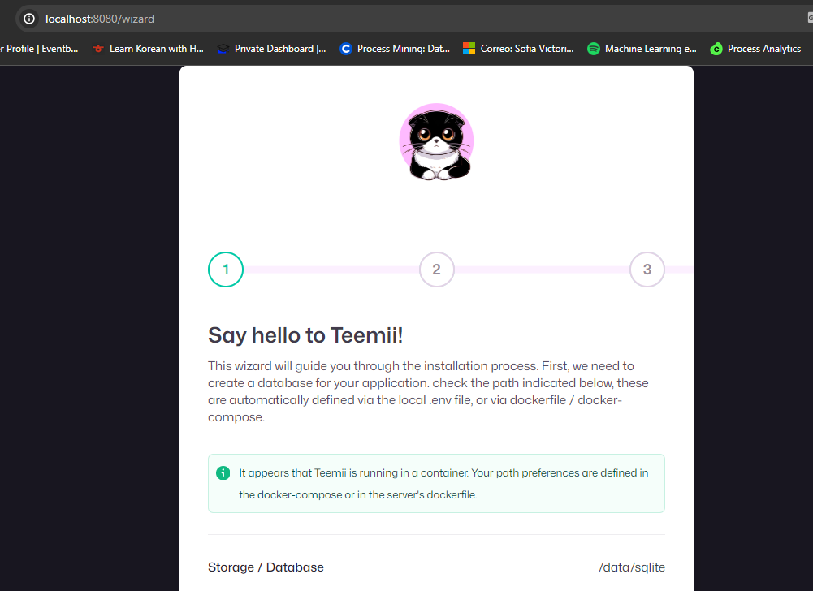

# Quiz 2

## Paso 1: Crear la red Docker
Comando Utilizado: docker network create teemii-network

## Paso 2: Crear volumen Docker y ejecutar el Contenedor del Back-end
Crear el volumen: docker volume create teemii-backend-data

Comando Utilizado: docker run -d --name teemii-backend --network teemii-network -v teemii-backend-data:/data -p 3000:3000 dokkaner/teemii-backend:develop

## Paso 3: Ejecutar el Contenedor del Front-end
Comando Utilizado: docker run -d --name teemii-frontend --network teemii-network -p 8080:80 dokkaner/teemii-frontend:develop

## Paso 4: Verificar los contenedores
Comando utilizado: docker ps

## Paso 5: Acceder a la página
http://localhost:8080

## Paso 6: Añadir Manga

## Paso 7: Eliminar el contenedor back-end y volver a crear el contenedor backend
Comando Utilizado: docker rm -f teemii-backend
Comando Utilizado: docker run -d --name teemii-backend --network teemii-network -v teemii-backend-data:/data -p 3000:3000 dokkaner/teemii-backend:develop
