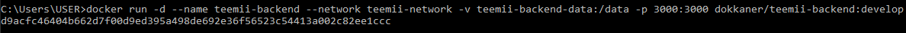

# Quiz 2

## Paso 1: Descargar las imágenes

## Paso 2: Pegar archivos en una carpeta en el VS y abrir una nueva terminal

## Paso 3: Levantar los contenedores
#### Comando utilizado: Docker-compose up -d

## Paso 4: Ingresar a la siguiente dirección
#### http://localhost:8080

## Paso 5: Detener y eliminar el contenedor “backend”
#### Comandos utilizados
#### docker stop teemii-master-backend-1
#### docker rm teemii-master-backend-1

