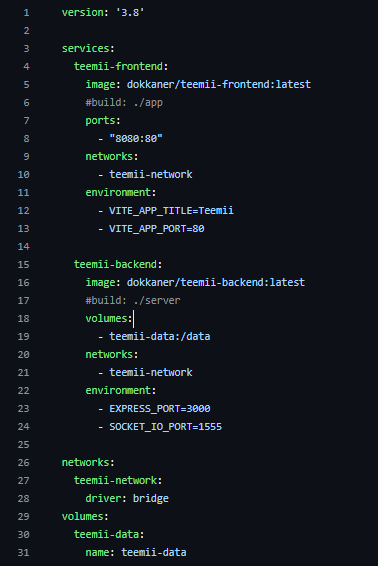
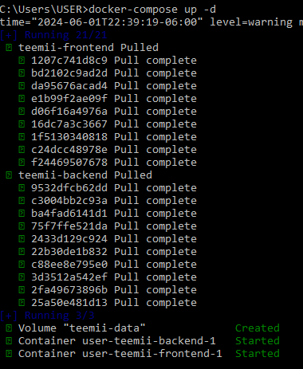
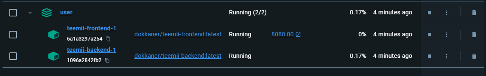
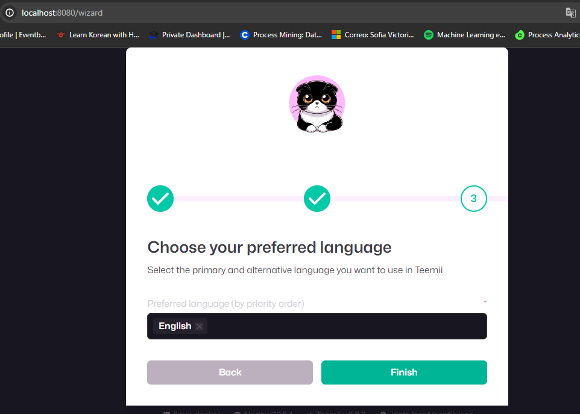
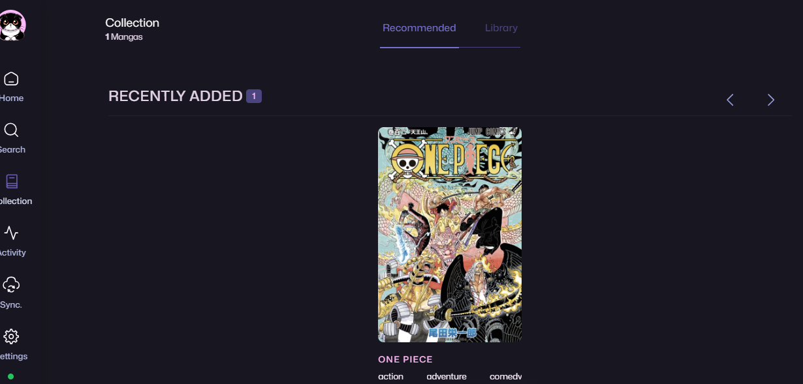
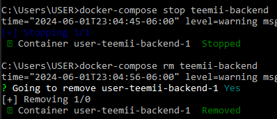
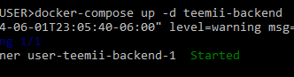

# Reto 3

## Paso 1: Archivo docker-compose.yml

## Paso 2: Docker Compose

comando: Docker-compose up -d

Vista en Docker Desktop

## Paso 3: Abrir enlace
http://localhost:8080

## Paso 4: Añadir manga

## Paso 5: Detener y Eliminar el contenedor

docker-compose stop teemii-backend
docker-compose rm teemii-backend

## Paso 6: Levantar el backend de nuevo
docker-compose up -d teemii-backend

